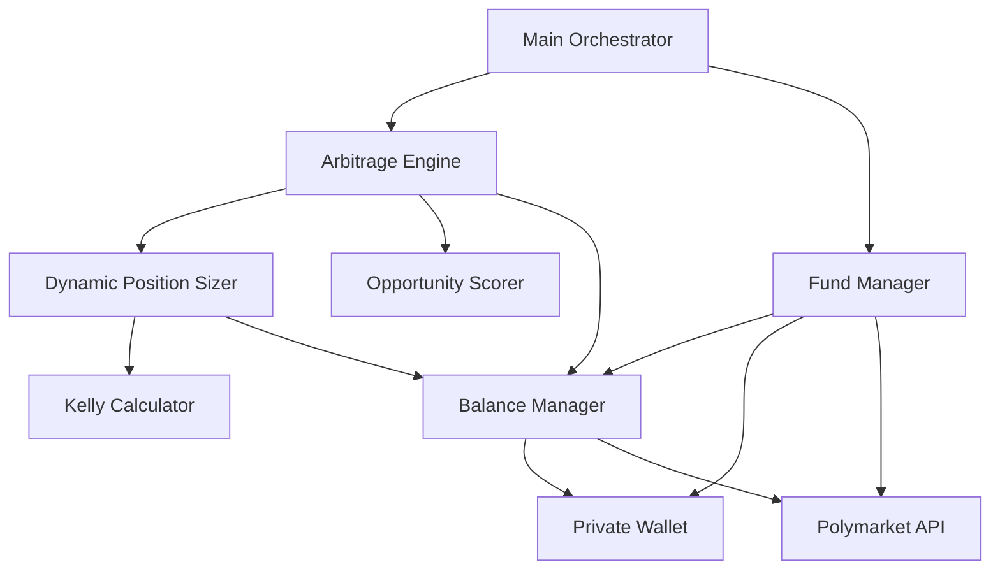

# Design Document: Dynamic Position Sizing and Smart Fund Management

## Overview

This design implements a comprehensive dynamic position sizing and smart fund management system for the Polymarket arbitrage bot. The system replaces hardcoded position sizes with intelligent, adaptive sizing based on multiple factors including available balance, opportunity quality, market conditions, and Kelly Criterion optimization.

The design introduces three new core components:
1. **Dynamic Position Sizer** - Calculates optimal trade sizes using Kelly Criterion, opportunity scores, and risk parameters
2. **Opportunity Scorer** - Evaluates arbitrage opportunities based on profit potential, market age, liquidity, and volatility
3. **Enhanced Fund Manager** - Intelligently manages deposits from private wallet to Polymarket based on balance thresholds and trading activity

The system integrates with existing components (Arbitrage Engine, Kelly Position Sizer) and fixes the current fund management logic that checks incorrect balance sources.

### Research Findings

Based on research into successful Polymarket arbitrage strategies:

**Key Insights:**
- Successful bots execute 40-90 trades per day with small position sizes
- API rate limits: 100 requests/minute (public), 60 orders/minute (trading)
- Profitable spreads need to exceed 2.5-3% after fees to remain viable
- Top performers use position sizes of $4,000-$5,000 with 98% win rates (but require significant capital)
- For small bankrolls ($50-$200), optimal position sizes are $0.50-$2.00 per trade
- Internal arbitrage (YES + NO < $1.00) is the most reliable strategy for consistent profits
- Market makers earn through providing liquidity, but arbitrage is more accessible for small capital

**Optimization Strategies:**
1. **Focus on new markets** (< 24 hours old) - higher volatility, more mispricing
2. **Target low liquidity markets** (< $1,000) - larger spreads available
3. **Prioritize high volatility** - more frequent arbitrage opportunities
4. **Use Fill-or-Kill (FOK) orders** - ensures atomic execution (already implemented)
5. **Monitor 15-minute crypto markets** - highest trading frequency (already implemented)

**Position Sizing for 40-90 Trades/Day:**
- With $50-$200 bankroll: $0.50-$1.00 per trade optimal
- Allows 50-100+ trades before needing to deposit more funds
- Minimizes risk while maximizing opportunity capture
- Aligns with Kelly Criterion at 5% bankroll cap

## Architecture

### Component Diagram



### Component Responsibilities

**Dynamic Position Sizer** (`src/dynamic_position_sizer.py`)
- Calculates optimal position size for each trade
- Integrates Kelly Criterion with opportunity scoring
- Enforces position size limits (min/max)
- Considers available balance and pending trades

**Opportunity Scorer** (`src/opportunity_scorer.py`)
- Evaluates arbitrage opportunities on multiple dimensions
- Calculates weighted score (0-1) based on profit %, market age, liquidity, volatility
- Provides scoring rationale for logging and debugging

**Balance Manager** (`src/balance_manager.py`)
- Queries and caches wallet balances (private + Polymarket)
- Calculates available balance (total - pending trades)
- Handles balance check retries and caching
- Provides unified balance interface

**Enhanced Fund Manager** (`src/fund_manager.py` - modified)
- Monitors Polymarket balance and triggers deposits when needed
- Checks private wallet balance (not Polymarket balance)
- Calculates dynamic deposit amounts based on trading activity
- Executes deposit transactions with error handling

**Arbitrage Engine** (`src/internal_arbitrage_engine.py` - modified)
- Integrates opportunity scoring before position sizing
- Uses dynamic position sizer instead of hardcoded stake
- Checks available balance before each trade
- Skips trades when insufficient balance

### Data Flow

1. **Opportunity Detection**: Arbitrage Engine identifies potential arbitrage opportunity
2. **Opportunity Scoring**: Opportunity Scorer evaluates opportunity quality → returns score (0-1)
3. **Balance Check**: Balance Manager queries current balances → returns available balance
4. **Position Sizing**: Dynamic Position Sizer calculates optimal size using Kelly + score + balance
5. **Trade Execution**: If position size ≥ minimum, execute trade; otherwise skip
6. **Fund Management**: Fund Manager monitors balances and deposits when thresholds met

## Components and Interfaces

### Dynamic Position Sizer

```python
class DynamicPositionSizer:
    """
    Calculates optimal position sizes for arbitrage trades using Kelly Criterion,
    opportunity scoring, and risk management constraints.
    """
    
    def __init__(
        self,
        kelly_calculator: KellyCalculator,
        balance_manager: BalanceManager,
        max_position_pct: float = 0.20,
        min_position_size: float = 0.10,
        fractional_kelly: float = 0.5
    ):
        """
        Initialize position sizer with dependencies and configuration.
        
        Args:
            kelly_calculator: Calculator for Kelly Criterion position sizing
            balance_manager: Manager for querying available balance
            max_position_pct: Maximum percentage of balance per trade (default: 20%)
            min_position_size: Minimum position size in USD (default: $0.10)
            fractional_kelly: Multiplier for Kelly size to reduce variance (default: 0.5)
        """
        pass
    
    def calculate_position_size(
        self,
        opportunity_score: float,
        profit_pct: float,
        win_probability: float
    ) -> float:
        """
        Calculate optimal position size for a trade.
        
        Args:
            opportunity_score: Quality score from Opportunity Scorer (0-1)
            profit_pct: Expected profit percentage (e.g., 0.05 for 5%)
            win_probability: Historical win rate for similar trades (0-1)
        
        Returns:
            Position size in USD, or 0 if trade should be skipped
        
        Logic:
            1. Get available balance from balance_manager
            2. Calculate Kelly size: kelly_calculator.calculate(win_prob, profit_pct)
            3. Apply fractional Kelly: kelly_size * fractional_kelly
            4. Apply opportunity score multiplier: kelly_size * (0.5 + 0.5 * opportunity_score)
            5. Enforce max position: min(calculated_size, available_balance * max_position_pct)
            6. Enforce min position: return 0 if size < min_position_size
            7. Check available balance: return 0 if size > available_balance
        """
        pass
    
    def get_position_sizing_details(self) -> dict:
        """
        Return detailed breakdown of last position sizing calculation for logging.
        
        Returns:
            Dictionary with keys: available_balance, kelly_size, opportunity_multiplier,
            final_size, was_capped, skip_reason
        """
        pass
```

### Opportunity Scorer

```python
class OpportunityScorer:
    """
    Evaluates arbitrage opportunities based on multiple quality factors.
    """
    
    # Scoring weights (must sum to 1.0)
    PROFIT_WEIGHT = 0.40
    VOLATILITY_WEIGHT = 0.25
    MARKET_AGE_WEIGHT = 0.20
    LIQUIDITY_WEIGHT = 0.15
    
    def __init__(self):
        """Initialize opportunity scorer."""
        pass
    
    def score_opportunity(
        self,
        profit_pct: float,
        market_age_hours: float,
        liquidity_usd: float,
        volatility: float
    ) -> float:
        """
        Calculate quality score for an arbitrage opportunity.
        
        Args:
            profit_pct: Expected profit percentage (e.g., 0.05 for 5%)
            market_age_hours: Age of market in hours since creation
            liquidity_usd: Total liquidity in market (USD)
            volatility: Price volatility measure (standard deviation of recent prices)
        
        Returns:
            Normalized score between 0 and 1 (higher is better)
        
        Scoring Logic:
            - Profit score: sigmoid(profit_pct * 100) to normalize 0-10% profit to 0-1
            - Age score: 1.0 if age < 24h, linear decay to 0.5 at 168h (1 week)
            - Liquidity score: 1.0 if liquidity < $1000, linear decay to 0.3 at $10000
            - Volatility score: min(volatility / 0.1, 1.0) to normalize 0-10% volatility
            - Final: weighted sum of component scores
        """
        pass
    
    def get_score_breakdown(self) -> dict:
        """
        Return detailed breakdown of last scoring calculation.
        
        Returns:
            Dictionary with component scores and weights for logging
        """
        pass
```

### Balance Manager

```python
class BalanceManager:
    """
    Manages balance queries and caching for private wallet and Polymarket.
    """
    
    def __init__(
        self,
        wallet_address: str,
        polymarket_client: PolymarketClient,
        cache_ttl_seconds: int = 30
    ):
        """
        Initialize balance manager.
        
        Args:
            wallet_address: Ethereum address of private wallet
            polymarket_client: Client for Polymarket API
            cache_ttl_seconds: Time-to-live for cached balance data (default: 30s)
        """
        pass
    
    def get_available_balance(self, pending_trades: List[float] = None) -> float:
        """
        Get total available balance for trading.
        
        Args:
            pending_trades: List of pending trade amounts to subtract (optional)
        
        Returns:
            Available balance in USD (private_wallet + polymarket - pending)
        
        Logic:
            1. Get private wallet balance (with caching and retry)
            2. Get Polymarket balance (with caching and retry)
            3. Calculate pending total: sum(pending_trades) if provided
            4. Return: private + polymarket - pending
        """
        pass
    
    def get_private_wallet_balance(self, force_refresh: bool = False) -> float:
        """
        Get private wallet USDC balance.
        
        Args:
            force_refresh: Skip cache and query blockchain directly
        
        Returns:
            Balance in USD
        
        Implements retry logic with exponential backoff (3 attempts)
        """
        pass
    
    def get_polymarket_balance(self, force_refresh: bool = False) -> float:
        """
        Get Polymarket account balance.
        
        Args:
            force_refresh: Skip cache and query API directly
        
        Returns:
            Balance in USD
        
        Implements retry logic with exponential backoff (3 attempts)
        """
        pass
    
    def invalidate_cache(self):
        """Force cache refresh on next balance query."""
        pass
```

### Enhanced Fund Manager

```python
class FundManager:
    """
    Manages deposits from private wallet to Polymarket based on balance thresholds.
    """
    
    def __init__(
        self,
        balance_manager: BalanceManager,
        polymarket_client: PolymarketClient,
        min_polymarket_balance: float = 1.0,
        private_wallet_threshold: float = 50.0,
        max_deposit_pct: float = 0.80
    ):
        """
        Initialize fund manager.
        
        Args:
            balance_manager: Manager for querying balances
            polymarket_client: Client for executing deposits
            min_polymarket_balance: Trigger deposit when Polymarket < this (default: $1)
            private_wallet_threshold: Threshold for deposit logic (default: $50)
            max_deposit_pct: Maximum % of private wallet to deposit (default: 80%)
        """
        pass
    
    def check_and_manage_balance(self, recent_trades: List[dict] = None) -> bool:
        """
        Check balances and deposit if needed.
        
        Args:
            recent_trades: List of recent trades for calculating average size (optional)
        
        Returns:
            True if deposit was executed, False otherwise
        
        Logic:
            1. Check Polymarket balance
            2. If Polymarket >= min_polymarket_balance: return False (no action needed)
            3. Check private wallet balance
            4. Calculate deposit amount based on private wallet balance and trading activity
            5. Execute deposit if amount > 0
            6. Return True if deposit executed
        """
        pass
    
    def calculate_deposit_amount(
        self,
        private_balance: float,
        recent_trades: List[dict] = None
    ) -> float:
        """
        Calculate optimal deposit amount based on balance and trading activity.
        
        Args:
            private_balance: Current private wallet balance
            recent_trades: Recent trades from last 24 hours (optional)
        
        Returns:
            Amount to deposit in USD
        
        Logic:
            Case 1: private_balance <= $1: return 0 (insufficient funds)
            Case 2: $1 < private_balance < $50:
                - Deposit all available (private_balance - $0.50 for gas)
            Case 3: private_balance >= $50:
                - Calculate avg trade size from recent_trades
                - If no recent trades: deposit min($1, 50% of private_balance)
                - If recent trades: deposit max(avg_trade_size * 10, $1)
                - Cap at max_deposit_pct * private_balance
        """
        pass
    
    def execute_deposit(self, amount: float) -> bool:
        """
        Execute deposit transaction from private wallet to Polymarket.
        
        Args:
            amount: Amount to deposit in USD
        
        Returns:
            True if successful, False otherwise
        
        Handles transaction errors and logs all attempts
        """
        pass
```

### Modified Arbitrage Engine

```python
class InternalArbitrageEngine:
    """
    Main trading engine with integrated opportunity scoring and dynamic position sizing.
    """
    
    def __init__(
        self,
        # ... existing parameters ...
        opportunity_scorer: OpportunityScorer,
        position_sizer: DynamicPositionSizer,
        balance_manager: BalanceManager
    ):
        """Add new dependencies to existing constructor."""
        pass
    
    def execute_arbitrage(self, opportunity: dict) -> bool:
        """
        Execute arbitrage trade with dynamic position sizing.
        
        Modified logic:
            1. Score opportunity using opportunity_scorer
            2. Get available balance from balance_manager
            3. Calculate position size using position_sizer
            4. If position_size == 0: log reason and skip trade
            5. Execute trade with calculated position size
            6. Update pending trades tracking
        """
        pass
    
    def score_opportunity(self, opportunity: dict) -> float:
        """
        Score an arbitrage opportunity.
        
        Args:
            opportunity: Dictionary with market data and profit info
        
        Returns:
            Opportunity score (0-1)
        
        Extracts required data from opportunity dict and calls opportunity_scorer
        """
        pass
```

## Data Models

### Configuration Model

```python
@dataclass
class PositionSizingConfig:
    """Configuration for dynamic position sizing."""
    max_position_pct: float = 0.20  # Maximum 20% of balance per trade
    min_position_size: float = 0.10  # Minimum $0.10 per trade
    fractional_kelly: float = 0.5  # Use 50% of full Kelly
    default_win_probability: float = 0.85  # Default when insufficient history
    
    def validate(self):
        """Validate configuration values are in acceptable ranges."""
        assert 0 < self.max_position_pct <= 1.0
        assert self.min_position_size > 0
        assert 0 < self.fractional_kelly <= 1.0
        assert 0 < self.default_win_probability < 1.0

@dataclass
class FundManagementConfig:
    """Configuration for fund management."""
    min_polymarket_balance: float = 1.0  # Trigger deposit at $1
    private_wallet_threshold: float = 50.0  # Threshold for deposit logic
    max_deposit_pct: float = 0.80  # Maximum 80% of private wallet
    gas_reserve: float = 0.50  # Reserve for gas fees
    
    def validate(self):
        """Validate configuration values are in acceptable ranges."""
        assert self.min_polymarket_balance > 0
        assert self.private_wallet_threshold > self.min_polymarket_balance
        assert 0 < self.max_deposit_pct <= 1.0
        assert self.gas_reserve >= 0

@dataclass
class BalanceSnapshot:
    """Snapshot of wallet balances at a point in time."""
    timestamp: float
    private_wallet: float
    polymarket: float
    pending_trades: float
    available: float
    
    def to_dict(self) -> dict:
        """Convert to dictionary for logging."""
        return {
            'timestamp': self.timestamp,
            'private_wallet': self.private_wallet,
            'polymarket': self.polymarket,
            'pending_trades': self.pending_trades,
            'available': self.available
        }

@dataclass
class OpportunityScore:
    """Detailed scoring breakdown for an opportunity."""
    total_score: float
    profit_score: float
    volatility_score: float
    age_score: float
    liquidity_score: float
    
    def to_dict(self) -> dict:
        """Convert to dictionary for logging."""
        return {
            'total': self.total_score,
            'profit': self.profit_score,
            'volatility': self.volatility_score,
            'age': self.age_score,
            'liquidity': self.liquidity_score
        }

@dataclass
class PositionSizingResult:
    """Result of position sizing calculation."""
    position_size: float
    available_balance: float
    kelly_size: float
    opportunity_multiplier: float
    was_capped: bool
    skip_reason: Optional[str]
    
    def to_dict(self) -> dict:
        """Convert to dictionary for logging."""
        return {
            'position_size': self.position_size,
            'available_balance': self.available_balance,
            'kelly_size': self.kelly_size,
            'opportunity_multiplier': self.opportunity_multiplier,
            'was_capped': self.was_capped,
            'skip_reason': self.skip_reason
        }
```


## Correctness Properties

*A property is a characteristic or behavior that should hold true across all valid executions of a system—essentially, a formal statement about what the system should do. Properties serve as the bridge between human-readable specifications and machine-verifiable correctness guarantees.*

### Property 1: Position Size Bounds Invariant

*For any* available balance, opportunity score, and Kelly inputs, the calculated position size must satisfy all of the following bounds:
- If non-zero, position size ≥ $0.10 (minimum viable position)
- Position size ≤ 20% of available balance (maximum risk limit)
- Position size ≤ available balance (cannot exceed funds)
- Position size ≥ 0 (no negative positions)

**Validates: Requirements 1.2, 1.5, 1.6, 5.3, 5.4**

### Property 2: Opportunity Score Monotonicity

*For any* two opportunities that differ in only one factor (profit %, volatility, market age, or liquidity), the opportunity with the more favorable value for that factor must receive a score greater than or equal to the other, where favorable means:
- Higher profit percentage → higher score
- Higher volatility → higher score
- Newer market (lower age) → higher score
- Lower liquidity → higher score

**Validates: Requirements 2.2, 2.3, 2.4, 2.5**

### Property 3: Opportunity Score Normalization

*For any* valid inputs (profit %, market age, liquidity, volatility), the opportunity score must be in the range [0, 1] inclusive.

**Validates: Requirements 2.6**

### Property 4: Opportunity Score Considers All Factors

*For any* opportunity, if we change any single input factor (profit %, market age, liquidity, or volatility) while holding others constant, the score must change (unless already at boundary 0 or 1).

**Validates: Requirements 2.1**

### Property 5: Position Size Increases with Opportunity Score

*For any* two opportunities with identical Kelly inputs and available balance but different opportunity scores, the opportunity with the higher score must receive a position size greater than or equal to the one with the lower score (subject to minimum position threshold).

**Validates: Requirements 1.3**

### Property 6: Available Balance Calculation

*For any* private wallet balance, Polymarket balance, and list of pending trade amounts, the calculated available balance must equal: private_wallet + polymarket - sum(pending_trades).

**Validates: Requirements 3.2**

### Property 7: Kelly Calculation Integration

*For any* win probability and profit percentage, changing either input must change the Kelly size calculation (unless result is capped by other constraints), demonstrating that both inputs are properly incorporated.

**Validates: Requirements 5.1, 5.2**

### Property 8: Fractional Kelly Application

*For any* Kelly size calculation, the final Kelly-based position must equal the full Kelly size multiplied by the fractional Kelly multiplier (default 0.5), before applying opportunity score adjustments.

**Validates: Requirements 5.5**

### Property 9: Deposit Amount Bounds

*For any* private wallet balance and trading history, the calculated deposit amount must satisfy:
- Deposit ≤ 80% of private wallet balance (maximum deposit limit)
- Deposit ≥ 0 (no negative deposits)
- If private_wallet ≤ $1: deposit = 0 (insufficient funds)

**Validates: Requirements 4.2, 4.3, 4.6**

### Property 10: Deposit Amount with No Trading History

*For any* private wallet balance > $1 with no recent trading activity, the deposit amount must equal min($1, 50% of private_wallet balance), capped at 80% of private_wallet.

**Validates: Requirements 4.5**

### Property 11: Deposit Amount Considers Trading History

*For any* two scenarios with identical private wallet balance but different recent trading histories, if the trading histories have different average trade sizes, the calculated deposit amounts must differ (unless capped by maximum deposit limit).

**Validates: Requirements 4.4**

### Property 12: Position Sizer Considers All Three Factors

*For any* position sizing calculation, the result must be influenced by all three factors: available balance, opportunity score, and Kelly criterion. This can be verified by showing that changing any single factor (while keeping others constant) changes the final position size (unless constrained by bounds).

**Validates: Requirements 1.1**

## Error Handling

### Balance Query Failures

**Retry Strategy:**
- Exponential backoff: 1s, 2s, 4s (3 attempts total)
- After all retries fail: use cached balance if < 5 minutes old
- If no cache available: skip current trade, log error, continue monitoring

**Error Types:**
- Network timeout: retry with backoff
- API rate limit: wait and retry
- Invalid response: log error, use cache if available
- Blockchain RPC failure: retry with different RPC endpoint if available

### Deposit Transaction Failures

**Failure Handling:**
- Transaction reverted: log error, do not retry immediately (wait 5 minutes)
- Insufficient gas: log error, wait for manual intervention (do not auto-retry)
- Nonce too low: refresh nonce and retry once
- Network error: retry after 30 seconds (max 2 retries)

**Safety Measures:**
- Never retry deposit immediately to avoid duplicate deposits
- Track pending deposits to prevent concurrent deposit attempts
- Log all deposit attempts with transaction hashes for debugging

### Position Sizing Edge Cases

**Insufficient Balance:**
- If available_balance < min_position_size: return 0, log skip reason
- If available_balance < calculated_size: return 0, log skip reason
- Continue monitoring for next opportunity

**Invalid Inputs:**
- Negative balances: log error, return 0
- Invalid opportunity scores (< 0 or > 1): clamp to [0, 1], log warning
- Invalid Kelly inputs: use default conservative values, log warning

### Configuration Errors

**Invalid Configuration:**
- Out-of-range values: use hardcoded defaults, log warning
- Missing configuration: use hardcoded defaults, log warning
- Configuration file not found: use all defaults, log warning

**Validation:**
- Validate all configuration on startup
- Log all configuration values being used
- Fail fast if critical configuration is invalid (e.g., wallet address)

## Testing Strategy

### Dual Testing Approach

This feature requires both unit tests and property-based tests for comprehensive coverage:

**Unit Tests** - Focus on:
- Specific examples demonstrating correct behavior
- Edge cases (insufficient balance, zero scores, boundary values)
- Error conditions (network failures, invalid inputs, transaction errors)
- Integration points between components
- Configuration loading and validation
- Logging output verification

**Property-Based Tests** - Focus on:
- Universal properties that hold for all inputs
- Invariants (bounds, normalization, monotonicity)
- Metamorphic properties (score relationships, position size relationships)
- Calculation correctness across wide input ranges
- Comprehensive input coverage through randomization

### Property-Based Testing Configuration

**Framework:** Hypothesis (Python property-based testing library)

**Test Configuration:**
- Minimum 100 iterations per property test (due to randomization)
- Each property test must reference its design document property
- Tag format: `# Feature: dynamic-position-sizing, Property {number}: {property_text}`

**Example Property Test Structure:**
```python
from hypothesis import given, strategies as st

@given(
    available_balance=st.floats(min_value=0, max_value=10000),
    opportunity_score=st.floats(min_value=0, max_value=1),
    win_probability=st.floats(min_value=0.01, max_value=0.99),
    profit_pct=st.floats(min_value=0.001, max_value=0.5)
)
def test_position_size_bounds_invariant(
    available_balance, opportunity_score, win_probability, profit_pct
):
    """
    Feature: dynamic-position-sizing, Property 1: Position Size Bounds Invariant
    
    For any available balance, opportunity score, and Kelly inputs,
    the calculated position size must satisfy all bounds.
    """
    # Test implementation
    pass
```

### Test Coverage Requirements

**Unit Test Coverage:**
- Configuration loading and validation
- Balance query retry logic with mocked failures
- Deposit transaction execution with various error scenarios
- Opportunity scoring with specific known inputs
- Position sizing with edge cases (zero balance, maximum score, etc.)
- Cache expiration and invalidation
- Logging output for all major operations

**Property Test Coverage:**
- All 12 correctness properties listed above
- Each property implemented as a single property-based test
- Minimum 100 iterations per test
- Wide input ranges to catch edge cases

### Integration Testing

**Component Integration:**
- Test full flow: opportunity detection → scoring → balance check → position sizing → trade execution
- Test fund management flow: balance monitoring → deposit calculation → deposit execution
- Test error recovery: balance check failure → cache fallback → trade skip → continue monitoring

**Mock External Dependencies:**
- Blockchain RPC calls (private wallet balance)
- Polymarket API calls (Polymarket balance, trade execution)
- Transaction submission (deposit transactions)

### Test Data Generation

**Hypothesis Strategies:**
- `balance_strategy`: floats in [0, 10000] for USD balances
- `score_strategy`: floats in [0, 1] for opportunity scores
- `probability_strategy`: floats in [0.01, 0.99] for win probabilities
- `profit_pct_strategy`: floats in [0.001, 0.5] for profit percentages (0.1% to 50%)
- `market_age_strategy`: floats in [0, 168] for market age in hours (0 to 1 week)
- `liquidity_strategy`: floats in [100, 50000] for market liquidity in USD
- `volatility_strategy`: floats in [0, 0.2] for volatility (0% to 20%)

**Edge Case Coverage:**
- Zero balances
- Very small balances (< $1)
- Very large balances (> $10,000)
- Boundary values for scores (0, 1)
- Minimum and maximum position sizes
- Cache expiration boundaries (29s, 30s, 31s)

