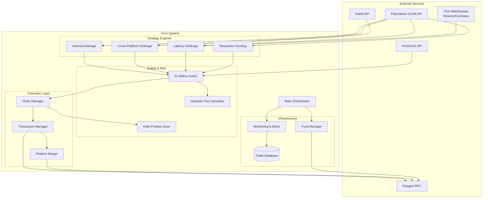
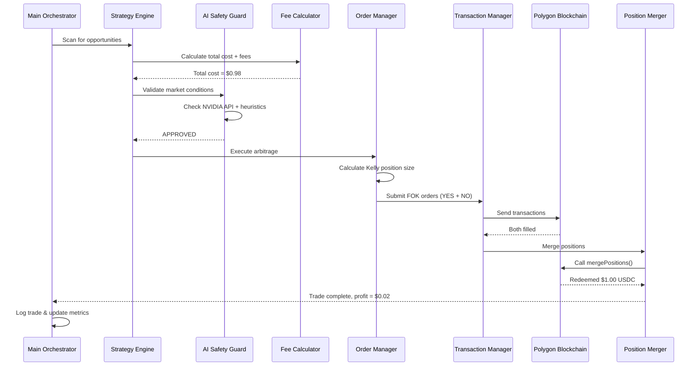

# Design Document: Polymarket Arbitrage Bot

## Overview

The Polymarket Arbitrage Bot is an autonomous trading system designed to achieve 99.5%+ win rates through mathematical arbitrage strategies on Polymarket's 15-minute crypto prediction markets. The system operates 24/7 on AWS infrastructure, executing risk-free trades by exploiting price inefficiencies across multiple strategies: internal arbitrage, cross-platform arbitrage, latency arbitrage, and resolution farming.

The architecture prioritizes:
- **Atomicity**: FOK orders ensure both sides of arbitrage fill or neither fills
- **Speed**: Sub-150ms execution latency using Rust core and WebSocket connections
- **Safety**: AI guardrails and fallback heuristics prevent trading during abnormal conditions
- **Autonomy**: Automated fund management, error recovery, and 24/7 operation
- **Observability**: Comprehensive logging, metrics, and alerting

The system builds upon existing production code (bot.py, rust_core) while adding critical improvements: accurate dynamic fee calculation, multi-strategy support, cross-platform integration, and enhanced monitoring.

## Architecture

### High-Level Architecture



### Component Interaction Flow



## Components and Interfaces

### 1. Main Orchestrator

**Responsibility**: Coordinates all system components, manages the main event loop, and handles lifecycle management.

**Interface**:
```python
class MainOrchestrator:
    def __init__(self, config: Config):
        """Initialize all components with configuration"""
        
    async def run(self) -> None:
        """Main event loop: scan markets, execute strategies, manage funds"""
        
    async def heartbeat_check(self) -> HealthStatus:
        """Verify system health: balance, gas, connectivity, pending TXs"""
        
    async def shutdown(self) -> None:
        """Graceful shutdown: close connections, flush logs, save state"""
```

**Key Behaviors**:
- Runs continuous loop scanning markets every 1-5 seconds
- Executes heartbeat checks every 60 seconds
- Triggers fund management when balance thresholds crossed
- Handles graceful shutdown on SIGTERM/SIGINT
- Implements circuit breaker after 10 consecutive failures

### 2. Strategy Engines

#### 2.1 Internal Arbitrage Engine

**Responsibility**: Detects and executes internal arbitrage (YES + NO < $1.00).

**Interface**:
```python
class InternalArbitrageEngine:
    def __init__(self, clob_client: CLOBClient, fee_calculator: FeeCalculator):
        """Initialize with CLOB client and fee calculator"""
        
    async def scan_opportunities(self, markets: List[Market]) -> List[Opportunity]:
        """Scan markets for internal arbitrage opportunities"""
        
    def calculate_profit(self, yes_price: Decimal, no_price: Decimal) -> Decimal:
        """Calculate expected profit after fees"""
        
    async def execute(self, opportunity: Opportunity) -> TradeResult:
        """Execute internal arbitrage trade"""
```

**Algorithm**:
```
For each market:
    yes_price = get_best_ask(YES)
    no_price = get_best_ask(NO)
    yes_fee = fee_calculator.calculate(yes_price)
    no_fee = fee_calculator.calculate(no_price)
    total_cost = yes_price + no_price + yes_fee + no_fee
    
    if total_cost < 0.995:  # 0.5% minimum profit
        profit = 1.00 - total_cost
        opportunity = Opportunity(
            market_id=market.id,
            yes_price=yes_price,
            no_price=no_price,
            profit=profit,
            strategy="internal_arbitrage"
        )
        yield opportunity
```

#### 2.2 Cross-Platform Arbitrage Engine

**Responsibility**: Exploits price differences between Polymarket and Kalshi.

**Interface**:
```python
class CrossPlatformArbitrageEngine:
    def __init__(self, polymarket_client: CLOBClient, kalshi_client: KalshiClient):
        """Initialize with both platform clients"""
        
    async def scan_opportunities(self) -> List[Opportunity]:
        """Find equivalent markets with price discrepancies"""
        
    async def execute(self, opportunity: Opportunity) -> TradeResult:
        """Execute simultaneous orders on both platforms"""
```

**Algorithm**:
```
For each equivalent market pair:
    pm_yes = polymarket.get_price(YES)
    kalshi_no = kalshi.get_price(NO)
    
    # Arbitrage: Buy YES on PM, NO on Kalshi
    if pm_yes + pm_fee < kalshi_no - kalshi_fee:
        profit = (kalshi_no - kalshi_fee) - (pm_yes + pm_fee)
        if profit > 0.005:  # 0.5% minimum
            yield Opportunity(...)
    
    # Reverse arbitrage
    pm_no = polymarket.get_price(NO)
    kalshi_yes = kalshi.get_price(YES)
    
    if pm_no + pm_fee < kalshi_yes - kalshi_fee:
        profit = (kalshi_yes - kalshi_fee) - (pm_no + pm_fee)
        if profit > 0.005:
            yield Opportunity(...)
```

#### 2.3 Latency Arbitrage Engine

**Responsibility**: Exploits lag between CEX price movements and Polymarket updates.

**Interface**:
```python
class LatencyArbitrageEngine:
    def __init__(self, cex_feeds: Dict[str, WebSocketFeed], clob_client: CLOBClient):
        """Initialize with CEX WebSocket feeds"""
        
    async def monitor_price_movements(self) -> AsyncIterator[PriceMovement]:
        """Stream CEX price movements in real-time"""
        
    async def check_polymarket_lag(self, movement: PriceMovement) -> Optional[Opportunity]:
        """Check if Polymarket prices lag CEX movement"""
        
    async def execute(self, opportunity: Opportunity) -> TradeResult:
        """Execute latency arbitrage trade"""
```

**Algorithm**:
```
On CEX price update:
    if abs(new_price - old_price) / old_price > 0.01:  # 1% move
        direction = "UP" if new_price > old_price else "DOWN"
        
        # Check Polymarket markets
        for market in get_markets_for_asset(asset):
            pm_price = market.get_price(direction)
            expected_price = calculate_expected_price(new_price, market)
            
            if abs(pm_price - expected_price) / expected_price > 0.01:
                # Polymarket lagging, opportunity exists
                if direction == "UP" and pm_price < expected_price:
                    # Buy YES, price will rise
                    profit = expected_price - pm_price - fees
                    if profit > 0.005:
                        yield Opportunity(...)
```

#### 2.4 Resolution Farming Engine

**Responsibility**: Buys near-certain positions (97-99¢) just before market close.

**Interface**:
```python
class ResolutionFarmingEngine:
    def __init__(self, clob_client: CLOBClient, cex_feeds: Dict[str, WebSocketFeed]):
        """Initialize with CLOB client and CEX feeds"""
        
    async def scan_closing_markets(self) -> List[Opportunity]:
        """Find markets closing within 2 minutes with certain outcomes"""
        
    def verify_outcome_certainty(self, market: Market) -> Optional[str]:
        """Verify outcome is certain based on CEX data"""
        
    async def execute(self, opportunity: Opportunity) -> TradeResult:
        """Execute resolution farming trade"""
```

**Algorithm**:
```
For each market closing in < 2 minutes:
    current_cex_price = get_cex_price(asset)
    market_strike = parse_strike_price(market.question)
    
    # Determine certain outcome
    if "above" in market.question:
        certain_outcome = "YES" if current_cex_price > market_strike else "NO"
    elif "below" in market.question:
        certain_outcome = "YES" if current_cex_price < market_strike else "NO"
    
    # Check if price is attractive
    outcome_price = market.get_price(certain_outcome)
    if 0.97 <= outcome_price <= 0.99:
        profit = 1.00 - outcome_price - fees
        if profit > 0.01:  # 1% minimum for resolution farming
            yield Opportunity(...)
```

### 3. Execution Layer

#### 3.1 Order Manager

**Responsibility**: Creates, submits, and tracks orders across platforms.

**Interface**:
```python
class OrderManager:
    def __init__(self, clob_client: CLOBClient, tx_manager: TransactionManager):
        """Initialize with CLOB client and transaction manager"""
        
    async def create_fok_order(self, market_id: str, side: str, price: Decimal, 
                               size: Decimal) -> Order:
        """Create a Fill-Or-Kill order"""
        
    async def submit_atomic_pair(self, yes_order: Order, no_order: Order) -> Tuple[bool, bool]:
        """Submit YES and NO orders atomically"""
        
    async def cancel_order(self, order_id: str) -> bool:
        """Cancel a pending order"""
```

**Key Behaviors**:
- All orders use FOK (Fill-Or-Kill) type
- Atomic pair submission: both fill or neither
- 0.1% maximum slippage tolerance
- Validates prices before submission
- Tracks pending orders to prevent nonce conflicts

#### 3.2 Position Merger

**Responsibility**: Merges YES and NO positions to redeem $1.00 USDC.

**Interface**:
```python
class PositionMerger:
    def __init__(self, web3: Web3, ctf_contract: Contract):
        """Initialize with Web3 instance and CTF contract"""
        
    async def merge_positions(self, market_id: str, amount: Decimal) -> TransactionReceipt:
        """Merge YES and NO positions for a market"""
        
    def estimate_gas(self, market_id: str, amount: Decimal) -> int:
        """Estimate gas cost for merge operation"""
```

**Algorithm**:
```
def merge_positions(market_id, amount):
    # Get token IDs for YES and NO
    condition_id = get_condition_id(market_id)
    yes_token_id = get_token_id(condition_id, outcome=0)
    no_token_id = get_token_id(condition_id, outcome=1)
    
    # Verify we own both positions
    yes_balance = ctf_contract.balanceOf(wallet_address, yes_token_id)
    no_balance = ctf_contract.balanceOf(wallet_address, no_token_id)
    assert yes_balance >= amount and no_balance >= amount
    
    # Call mergePositions on CTF contract
    tx = ctf_contract.functions.mergePositions(
        collateral_token=USDC_ADDRESS,
        parent_collection_id=ZERO_BYTES32,
        condition_id=condition_id,
        partition=[1, 2],  # YES and NO
        amount=amount
    ).build_transaction({
        'from': wallet_address,
        'gas': estimate_gas(),
        'gasPrice': get_gas_price()
    })
    
    signed_tx = sign_transaction(tx)
    tx_hash = send_transaction(signed_tx)
    receipt = wait_for_receipt(tx_hash)
    
    # Verify USDC balance increased by amount
    assert usdc_balance_after == usdc_balance_before + amount
    return receipt
```

#### 3.3 Transaction Manager

**Responsibility**: Manages transaction submission, nonce tracking, and retry logic.

**Interface**:
```python
class TransactionManager:
    def __init__(self, web3: Web3, wallet: Account):
        """Initialize with Web3 instance and wallet"""
        
    async def send_transaction(self, tx: Dict) -> str:
        """Send transaction with nonce management"""
        
    async def wait_for_confirmation(self, tx_hash: str, timeout: int = 60) -> TransactionReceipt:
        """Wait for transaction confirmation"""
        
    async def resubmit_stuck_transaction(self, tx_hash: str) -> str:
        """Resubmit stuck transaction with higher gas"""
        
    def get_pending_count(self) -> int:
        """Get count of pending transactions"""
```

**Key Behaviors**:
- Tracks pending nonces to avoid conflicts
- Limits pending transactions to 5 maximum
- Resubmits stuck transactions (pending > 60s) with 10% higher gas
- Implements exponential backoff for network errors
- Validates transaction success before returning

### 4. Safety & Risk Management

#### 4.1 AI Safety Guard

**Responsibility**: Validates market conditions using AI and fallback heuristics.

**Interface**:
```python
class AISafetyGuard:
    def __init__(self, nvidia_api_key: str, config: SafetyConfig):
        """Initialize with NVIDIA API credentials"""
        
    async def validate_trade(self, opportunity: Opportunity, market: Market) -> SafetyDecision:
        """Validate if trade is safe to execute"""
        
    async def check_nvidia_api(self, market_context: str) -> bool:
        """Query NVIDIA AI API for safety check"""
        
    def fallback_heuristics(self, market: Market) -> bool:
        """Apply fallback safety heuristics"""
```

**Decision Logic**:
```
def validate_trade(opportunity, market):
    # Check volatility
    if recent_volatility(market.asset) > 0.05:  # 5% in 1 minute
        return SafetyDecision(approved=False, reason="High volatility")
    
    # Check ambiguous resolution
    if has_ambiguous_keywords(market.question):
        return SafetyDecision(approved=False, reason="Ambiguous resolution")
    
    # Query NVIDIA AI
    try:
        context = f"Market: {market.question}, Current price: {market.price}, Volume: {market.volume}"
        response = await nvidia_api.query(context, timeout=2.0)
        ai_approved = parse_yes_no_response(response)
    except TimeoutError:
        ai_approved = None
    
    # Fallback heuristics if AI unavailable
    if ai_approved is None:
        balance_ok = get_balance() > 10.0
        gas_ok = get_gas_price() < 800
        pending_ok = get_pending_tx_count() < 5
        ai_approved = balance_ok and gas_ok and pending_ok
    
    if not ai_approved:
        return SafetyDecision(approved=False, reason="AI safety check failed")
    
    return SafetyDecision(approved=True, reason="All checks passed")
```

#### 4.2 Dynamic Fee Calculator

**Responsibility**: Calculates Polymarket's 2025 dynamic fee structure.

**Interface**:
```python
class DynamicFeeCalculator:
    def __init__(self):
        """Initialize fee calculator with caching"""
        self._cache: Dict[Decimal, Decimal] = {}
        
    def calculate_fee(self, price: Decimal) -> Decimal:
        """Calculate fee for a given price using 2025 formula"""
        
    def calculate_total_cost(self, yes_price: Decimal, no_price: Decimal) -> Decimal:
        """Calculate total cost including both fees"""
```

**Implementation**:
```python
def calculate_fee(self, price: Decimal) -> Decimal:
    """
    Polymarket 2025 dynamic fee formula:
    fee = max(0.001, 0.03 * (1.0 - abs(2.0 * price - 1.0)))
    
    Fee peaks at 3% near 50% odds and tapers to 0.1% at extremes.
    """
    # Check cache
    if price in self._cache:
        return self._cache[price]
    
    # Calculate fee
    # abs(2.0 * price - 1.0) measures distance from 50%
    # When price = 0.5: abs(2.0 * 0.5 - 1.0) = 0, fee = 3%
    # When price = 0.0 or 1.0: abs(2.0 * price - 1.0) = 1, fee = 0.1%
    certainty = abs(Decimal('2.0') * price - Decimal('1.0'))
    fee = max(Decimal('0.001'), Decimal('0.03') * (Decimal('1.0') - certainty))
    
    # Cache result
    self._cache[price] = fee
    return fee

def calculate_total_cost(self, yes_price: Decimal, no_price: Decimal) -> Decimal:
    """Calculate total cost for internal arbitrage"""
    yes_fee = self.calculate_fee(yes_price)
    no_fee = self.calculate_fee(no_price)
    
    # Total cost = prices + fees
    total = yes_price + no_price + (yes_price * yes_fee) + (no_price * no_fee)
    return total
```

#### 4.3 Kelly Position Sizer

**Responsibility**: Calculates optimal position sizes using Kelly Criterion.

**Interface**:
```python
class KellyPositionSizer:
    def __init__(self, config: PositionSizingConfig):
        """Initialize with position sizing configuration"""
        
    def calculate_position_size(self, opportunity: Opportunity, bankroll: Decimal) -> Decimal:
        """Calculate optimal position size using Kelly Criterion"""
        
    def get_max_position_size(self) -> Decimal:
        """Get maximum allowed position size"""
```

**Implementation**:
```python
def calculate_position_size(self, opportunity: Opportunity, bankroll: Decimal) -> Decimal:
    """
    Kelly Criterion: f = (bp - q) / b
    where:
        f = fraction of bankroll to bet
        b = odds (profit / cost)
        p = win probability
        q = 1 - p (loss probability)
    
    For arbitrage: p ≈ 0.995 (99.5% win rate)
    """
    # For arbitrage, win probability is very high
    win_prob = Decimal('0.995')
    loss_prob = Decimal('0.005')
    
    # Calculate odds
    cost = opportunity.total_cost
    profit = opportunity.expected_profit
    odds = profit / cost if cost > 0 else Decimal('0')
    
    # Kelly formula
    kelly_fraction = (odds * win_prob - loss_prob) / odds if odds > 0 else Decimal('0')
    
    # Cap at 5% of bankroll (fractional Kelly for safety)
    kelly_fraction = min(kelly_fraction, Decimal('0.05'))
    
    # Calculate position size
    position_size = bankroll * kelly_fraction
    
    # Apply min/max constraints
    if bankroll < 100:
        # Small bankroll: use fixed sizes
        position_size = min(position_size, Decimal('1.0'))
        position_size = max(position_size, Decimal('0.1'))
    else:
        # Larger bankroll: scale up to $5 max
        position_size = min(position_size, Decimal('5.0'))
    
    return position_size
```

### 5. Infrastructure Components

#### 5.1 Fund Manager

**Responsibility**: Manages deposits, withdrawals, and multi-chain operations.

**Interface**:
```python
class FundManager:
    def __init__(self, web3: Web3, clob_client: CLOBClient, config: FundConfig):
        """Initialize with Web3, CLOB client, and configuration"""
        
    async def check_balance(self) -> Tuple[Decimal, Decimal]:
        """Check EOA and Proxy wallet balances"""
        
    async def auto_deposit(self, amount: Decimal) -> TransactionReceipt:
        """Deposit USDC from EOA to Proxy wallet"""
        
    async def auto_withdraw(self, amount: Decimal) -> TransactionReceipt:
        """Withdraw USDC from Proxy to EOA wallet"""
        
    async def cross_chain_deposit(self, source_chain: str, token: str, amount: Decimal) -> TransactionReceipt:
        """Swap and bridge from another chain"""
```

**Auto-Deposit Logic**:
```
async def check_and_manage_balance():
    eoa_balance, proxy_balance = await fund_manager.check_balance()
    
    # Auto-deposit if proxy balance low
    if proxy_balance < MIN_BALANCE:
        deposit_amount = TARGET_BALANCE - proxy_balance
        if eoa_balance >= deposit_amount:
            await fund_manager.auto_deposit(deposit_amount)
            log.info(f"Auto-deposited {deposit_amount} USDC")
        else:
            alert.send("Low balance: EOA has insufficient USDC")
    
    # Auto-withdraw if proxy balance high
    if proxy_balance > WITHDRAW_LIMIT:
        withdraw_amount = proxy_balance - TARGET_BALANCE
        await fund_manager.auto_withdraw(withdraw_amount)
        log.info(f"Auto-withdrew {withdraw_amount} USDC profit")
```

#### 5.2 Monitoring & Alerts

**Responsibility**: Exposes metrics, logs events, sends alerts, and provides real-time debug output.

**Interface**:
```python
class MonitoringSystem:
    def __init__(self, config: MonitoringConfig):
        """Initialize Prometheus metrics and CloudWatch logger"""
        
    def record_trade(self, trade: TradeResult) -> None:
        """Record trade metrics"""
        
    def record_error(self, error: Exception, context: Dict) -> None:
        """Log error with context"""
        
    async def send_alert(self, severity: str, message: str) -> None:
        """Send SNS alert"""
        
    def get_metrics_summary(self) -> MetricsSummary:
        """Get current metrics summary"""
        
    def print_status_dashboard(self) -> None:
        """Print real-time status dashboard to console"""
        
    def log_heartbeat(self, status: HealthStatus) -> None:
        """Log detailed heartbeat information"""
```

**Real-Time Status Dashboard**:

The system will display a continuously updating console dashboard showing:

```
╔══════════════════════════════════════════════════════════════════════════════╗
║                    POLYMARKET ARBITRAGE BOT - LIVE STATUS                    ║
╚══════════════════════════════════════════════════════════════════════════════╝

[SYSTEM STATUS]
  Status: ● RUNNING | Uptime: 2h 34m 12s | Mode: LIVE TRADING
  Circuit Breaker: ✓ CLOSED | Last Heartbeat: 2s ago | Health: ✓ HEALTHY

[BALANCES]
  EOA Wallet:    $1,234.56 USDC (0x1234...5678)
  Proxy Wallet:  $456.78 USDC (Trading Balance)
  Total Assets:  $1,691.34 USDC
  
[PORTFOLIO PERFORMANCE]
  Total Trades:       1,247 | Win Rate: 99.6% ✓
  Successful:         1,242 | Failed: 5
  Total Profit:       $234.56 | Avg Profit/Trade: $0.19
  Total Gas Cost:     $12.34 | Net Profit: $222.22
  Profit Factor:      19.0x | Sharpe Ratio: 3.2
  Max Drawdown:       -$2.10 (0.9%)

[CURRENT SCAN - Cycle #4,521]
  Markets Scanned:    47 | Opportunities Found: 2
  Scan Latency:       142ms | Last Scan: 1.2s ago
  
  Active Opportunities:
    1. BTC-15m-95000 | Internal Arb | Profit: $0.52 (0.52%) | Status: EVALUATING
       YES: $0.48 (fee: 2.8%) | NO: $0.47 (fee: 2.9%) | Total: $0.9748
       AI Safety: ✓ APPROVED | Gas: 45 gwei ✓ | Volatility: 0.8% ✓
       
    2. ETH-15m-3500 | Internal Arb | Profit: $0.31 (0.31%) | Status: SKIPPED
       Reason: Profit below threshold (min: 0.5%)

[GAS & NETWORK]
  Current Gas Price:  45 gwei ✓ (Max: 800 gwei)
  Fast Gas Price:     52 gwei
  Pending TXs:        2 / 5 ✓
  RPC Endpoint:       Polygon Mainnet (Alchemy) | Latency: 89ms ✓
  Block Number:       #52,341,234 | Last Block: 2s ago

[RECENT ACTIVITY - Last 5 Trades]
  [10:34:12] ✓ BTC-15m-94500 | Internal | +$0.48 | Gas: $0.02 | Net: +$0.46
  [10:32:45] ✓ SOL-15m-180 | Internal | +$0.62 | Gas: $0.03 | Net: +$0.59
  [10:31:18] ✓ ETH-15m-3450 | Internal | +$0.55 | Gas: $0.02 | Net: +$0.53
  [10:29:52] ✗ XRP-15m-2.5 | Internal | FAILED | Reason: FOK order not filled
  [10:28:30] ✓ BTC-15m-94000 | Internal | +$0.71 | Gas: $0.03 | Net: +$0.68

[FUND MANAGEMENT]
  Auto-Deposit:       ✓ ENABLED | Trigger: < $50 | Target: $100
  Auto-Withdraw:      ✓ ENABLED | Trigger: > $500 | Last: 2h ago ($150)
  Next Deposit Check: 58s
  
[SAFETY CHECKS]
  AI Safety Guard:    ✓ ACTIVE (NVIDIA API) | Response Time: 234ms
  Volatility Monitor: ✓ ACTIVE | BTC: 0.8% | ETH: 1.2% | SOL: 2.1% | XRP: 1.5%
  Ambiguous Markets:  3 filtered | Keywords: ["approximately", "around"]
  
[ERRORS & ALERTS - Last Hour]
  Network Errors:     2 (auto-recovered)
  API Timeouts:       1 (fallback used)
  Failed Trades:      1 (legging risk avoided)
  Alerts Sent:        0

[DEBUG MODE: VERBOSE]
  ▶ [10:34:45.123] Scanning 47 markets...
  ▶ [10:34:45.265] Found opportunity: BTC-15m-95000 (profit: $0.52)
  ▶ [10:34:45.267] Calculating fees: YES=$0.48 → fee=2.8%, NO=$0.47 → fee=2.9%
  ▶ [10:34:45.268] Total cost: $0.9748 | Profit: $0.0252 (0.52%)
  ▶ [10:34:45.270] Querying AI Safety Guard...
  ▶ [10:34:45.504] AI Safety: APPROVED (confidence: 0.95)
  ▶ [10:34:45.505] Checking volatility: BTC 1-min change: 0.8% ✓
  ▶ [10:34:45.506] Gas price check: 45 gwei ✓
  ▶ [10:34:45.507] Pending TX check: 2/5 ✓
  ▶ [10:34:45.508] Calculating position size (Kelly): $1.23
  ▶ [10:34:45.510] Creating FOK orders: YES @ $0.48, NO @ $0.47
  ▶ [10:34:45.512] Submitting atomic order pair...
  ▶ [10:34:45.789] YES order filled: tx=0xabc...def
  ▶ [10:34:45.791] NO order filled: tx=0x123...456
  ▶ [10:34:45.792] Both orders filled ✓ Proceeding to merge...
  ▶ [10:34:45.950] Merging positions: tx=0x789...012
  ▶ [10:34:46.234] Merge confirmed ✓ Redeemed: $1.00 USDC
  ▶ [10:34:46.235] Trade complete: Profit=$0.48, Gas=$0.02, Net=$0.46 ✓
  ▶ [10:34:46.236] Updated metrics: Total trades=1247, Win rate=99.6%

[NEXT ACTIONS]
  ⏳ Waiting 1.2s before next scan...
  ⏳ Heartbeat check in 58s...
  ⏳ Balance check in 58s...

Press Ctrl+C to stop | Press 'h' for help | Press 'd' to toggle debug
╚══════════════════════════════════════════════════════════════════════════════╝
```

**Prometheus Metrics**:
```python
# Counter metrics
trades_total = Counter('trades_total', 'Total trades executed', ['strategy', 'status'])
trades_successful = Counter('trades_successful', 'Successful trades', ['strategy'])
trades_failed = Counter('trades_failed', 'Failed trades', ['strategy', 'reason'])
opportunities_found = Counter('opportunities_found', 'Opportunities detected', ['strategy'])
opportunities_skipped = Counter('opportunities_skipped', 'Opportunities skipped', ['reason'])
ai_safety_checks = Counter('ai_safety_checks', 'AI safety checks', ['result'])
network_errors = Counter('network_errors', 'Network errors', ['type'])
api_calls = Counter('api_calls', 'API calls', ['endpoint', 'status'])

# Gauge metrics
balance_eoa_usd = Gauge('balance_eoa_usd', 'EOA wallet USDC balance')
balance_proxy_usd = Gauge('balance_proxy_usd', 'Proxy wallet USDC balance')
balance_total_usd = Gauge('balance_total_usd', 'Total USDC balance')
profit_usd = Gauge('profit_usd', 'Total profit in USD')
profit_net_usd = Gauge('profit_net_usd', 'Net profit after gas in USD')
win_rate = Gauge('win_rate', 'Win rate percentage')
gas_price_gwei = Gauge('gas_price_gwei', 'Current gas price')
pending_tx_count = Gauge('pending_tx_count', 'Pending transactions')
markets_scanned = Gauge('markets_scanned', 'Markets in last scan')
circuit_breaker_status = Gauge('circuit_breaker_status', 'Circuit breaker status (0=closed, 1=open)')
consecutive_failures = Gauge('consecutive_failures', 'Consecutive failed trades')

# Histogram metrics
latency_ms = Histogram('latency_ms', 'Execution latency in milliseconds', ['operation'])
profit_per_trade = Histogram('profit_per_trade', 'Profit per trade in USD')
gas_cost_per_trade = Histogram('gas_cost_per_trade', 'Gas cost per trade in USD')
scan_duration_ms = Histogram('scan_duration_ms', 'Market scan duration in milliseconds')
ai_response_time_ms = Histogram('ai_response_time_ms', 'AI safety check response time')
```

**Detailed Logging Levels**:

```python
# DEBUG: Verbose operation details
logger.debug(f"Fetching markets from CLOB API...")
logger.debug(f"Received {len(markets)} markets")
logger.debug(f"Filtering to 15-min crypto markets...")
logger.debug(f"Calculating fees for YES=${yes_price}, NO=${no_price}")

# INFO: Normal operations
logger.info(f"Scanning {len(markets)} markets for opportunities")
logger.info(f"Found {len(opportunities)} opportunities")
logger.info(f"Executing trade: {opportunity.market_id}")
logger.info(f"Trade successful: profit=${profit}, gas=${gas_cost}")

# WARNING: Recoverable issues
logger.warning(f"Network timeout, retrying... (attempt {attempt}/5)")
logger.warning(f"AI Safety Guard timeout, using fallback heuristics")
logger.warning(f"Gas price high: {gas_price} gwei (max: 800)")

# ERROR: Failed operations
logger.error(f"FOK order failed to fill: {order_id}")
logger.error(f"Position merge failed: {error_message}")
logger.error(f"RPC endpoint unavailable, failing over to backup")

# CRITICAL: System-level failures
logger.critical(f"Circuit breaker activated: {consecutive_failures} failures")
logger.critical(f"Balance critically low: ${balance} (min: $10)")
logger.critical(f"All RPC endpoints unavailable")
```

**Heartbeat Logging**:

Every 60 seconds, log comprehensive system status:

```python
async def log_heartbeat():
    status = await get_health_status()
    
    logger.info("=" * 80)
    logger.info("HEARTBEAT CHECK")
    logger.info("=" * 80)
    logger.info(f"Timestamp: {status.timestamp}")
    logger.info(f"Overall Health: {'✓ HEALTHY' if status.is_healthy else '✗ UNHEALTHY'}")
    logger.info("")
    logger.info("BALANCES:")
    logger.info(f"  EOA Wallet:   ${status.eoa_balance:.2f} USDC")
    logger.info(f"  Proxy Wallet: ${status.proxy_balance:.2f} USDC")
    logger.info(f"  Total:        ${status.total_balance:.2f} USDC")
    logger.info("")
    logger.info("NETWORK:")
    logger.info(f"  Gas Price:    {status.gas_price_gwei} gwei {'✓' if status.gas_ok else '✗'}")
    logger.info(f"  Pending TXs:  {status.pending_tx_count}/5 {'✓' if status.pending_tx_ok else '✗'}")
    logger.info(f"  RPC Latency:  {status.rpc_latency_ms}ms")
    logger.info(f"  Block Number: #{status.block_number}")
    logger.info("")
    logger.info("PERFORMANCE:")
    logger.info(f"  Total Trades:     {status.total_trades}")
    logger.info(f"  Win Rate:         {status.win_rate:.2f}% {'✓' if status.win_rate >= 99.5 else '✗'}")
    logger.info(f"  Total Profit:     ${status.total_profit:.2f}")
    logger.info(f"  Avg Profit/Trade: ${status.avg_profit_per_trade:.2f}")
    logger.info(f"  Total Gas Cost:   ${status.total_gas_cost:.2f}")
    logger.info(f"  Net Profit:       ${status.net_profit:.2f}")
    logger.info("")
    logger.info("SAFETY:")
    logger.info(f"  Circuit Breaker:      {'OPEN ✗' if status.circuit_breaker_open else 'CLOSED ✓'}")
    logger.info(f"  Consecutive Failures: {status.consecutive_failures}/10")
    logger.info(f"  AI Safety Active:     {'✓' if status.ai_safety_active else '✗'}")
    logger.info("")
    
    if status.issues:
        logger.warning("ISSUES DETECTED:")
        for issue in status.issues:
            logger.warning(f"  - {issue}")
    else:
        logger.info("No issues detected ✓")
    
    logger.info("=" * 80)
```

## Data Models

### Market

```python
@dataclass
class Market:
    """Represents a Polymarket prediction market"""
    market_id: str
    question: str
    asset: str  # BTC, ETH, SOL, XRP
    outcomes: List[str]  # ["YES", "NO"]
    yes_price: Decimal
    no_price: Decimal
    yes_token_id: str
    no_token_id: str
    volume: Decimal
    liquidity: Decimal
    end_time: datetime
    resolution_source: str
    
    def is_crypto_15min(self) -> bool:
        """Check if this is a 15-minute crypto market"""
        duration = self.end_time - datetime.now()
        is_15min = 14 <= duration.total_seconds() / 60 <= 16
        is_crypto = any(asset in self.question.upper() for asset in ["BTC", "ETH", "SOL", "XRP"])
        return is_15min and is_crypto
    
    def parse_strike_price(self) -> Optional[Decimal]:
        """Extract strike price from question (e.g., 'BTC above $95,000')"""
        import re
        match = re.search(r'\$?([\d,]+(?:\.\d+)?)', self.question)
        if match:
            price_str = match.group(1).replace(',', '')
            return Decimal(price_str)
        return None
```

### Opportunity

```python
@dataclass
class Opportunity:
    """Represents an arbitrage opportunity"""
    opportunity_id: str
    market_id: str
    strategy: str  # "internal", "cross_platform", "latency", "resolution_farming"
    timestamp: datetime
    
    # Pricing
    yes_price: Decimal
    no_price: Decimal
    yes_fee: Decimal
    no_fee: Decimal
    total_cost: Decimal
    expected_profit: Decimal
    profit_percentage: Decimal
    
    # Execution details
    position_size: Decimal
    gas_estimate: int
    
    # Cross-platform specific
    platform_a: Optional[str] = None
    platform_b: Optional[str] = None
    
    def is_profitable(self, min_profit_threshold: Decimal = Decimal('0.005')) -> bool:
        """Check if opportunity meets minimum profit threshold"""
        return self.profit_percentage >= min_profit_threshold
```

### TradeResult

```python
@dataclass
class TradeResult:
    """Represents the result of an executed trade"""
    trade_id: str
    opportunity: Opportunity
    timestamp: datetime
    status: str  # "success", "failed", "partial"
    
    # Execution details
    yes_order_id: Optional[str]
    no_order_id: Optional[str]
    yes_filled: bool
    no_filled: bool
    yes_fill_price: Optional[Decimal]
    no_fill_price: Optional[Decimal]
    
    # Financial results
    actual_cost: Decimal
    actual_profit: Decimal
    gas_cost: Decimal
    net_profit: Decimal
    
    # Transaction hashes
    yes_tx_hash: Optional[str]
    no_tx_hash: Optional[str]
    merge_tx_hash: Optional[str]
    
    # Error information
    error_message: Optional[str] = None
    
    def was_successful(self) -> bool:
        """Check if trade was successful"""
        return self.status == "success" and self.yes_filled and self.no_filled
```

### SafetyDecision

```python
@dataclass
class SafetyDecision:
    """Represents an AI safety check decision"""
    approved: bool
    reason: str
    timestamp: datetime
    checks_performed: Dict[str, bool]  # {"nvidia_api": True, "volatility": True, ...}
    ai_response: Optional[str] = None
    fallback_used: bool = False
```

### Config

```python
@dataclass
class Config:
    """System configuration"""
    # Wallet & Keys
    private_key: str
    wallet_address: str
    
    # RPC & APIs
    polygon_rpc_url: str
    backup_rpc_urls: List[str]
    polymarket_api_url: str
    kalshi_api_key: Optional[str]
    nvidia_api_key: str
    
    # Contract addresses
    usdc_address: str
    ctf_exchange_address: str
    conditional_token_address: str
    
    # Trading parameters
    stake_amount: Decimal
    min_profit_threshold: Decimal  # 0.005 = 0.5%
    max_position_size: Decimal  # 5.0
    min_position_size: Decimal  # 0.1
    
    # Risk management
    max_pending_tx: int  # 5
    max_gas_price_gwei: int  # 800
    circuit_breaker_threshold: int  # 10 consecutive failures
    
    # Fund management
    min_balance: Decimal  # 50.0
    target_balance: Decimal  # 100.0
    withdraw_limit: Decimal  # 500.0
    
    # Monitoring
    cloudwatch_log_group: str
    sns_alert_topic: str
    prometheus_port: int  # 9090
    
    # Operational
    dry_run: bool
    scan_interval_seconds: int  # 1-5
    heartbeat_interval_seconds: int  # 60
```

### HealthStatus

```python
@dataclass
class HealthStatus:
    """System health status"""
    timestamp: datetime
    is_healthy: bool
    
    # Component health
    balance_ok: bool
    balance_usd: Decimal
    gas_ok: bool
    gas_price_gwei: int
    pending_tx_ok: bool
    pending_tx_count: int
    api_connectivity_ok: bool
    
    # Performance metrics
    recent_win_rate: Decimal  # Last 100 trades
    recent_error_rate: Decimal
    avg_latency_ms: float
    
    # Issues
    issues: List[str]
```


## Correctness Properties

*A property is a characteristic or behavior that should hold true across all valid executions of a system—essentially, a formal statement about what the system should do. Properties serve as the bridge between human-readable specifications and machine-verifiable correctness guarantees.*

### Property 1: Dynamic Fee Calculation Accuracy

*For any* position price between 0.0 and 1.0, the calculated fee should equal max(0.001, 0.03 * (1.0 - abs(2.0 * price - 1.0))), with fees peaking at ~3% near 50% odds and approaching 0.1% at price extremes.

**Validates: Requirements 1.7, 2.1**

### Property 2: Internal Arbitrage Detection

*For any* market with YES and NO prices, if the total cost (YES_price + NO_price + YES_fee + NO_fee) is less than $0.995, the system should identify it as a valid internal arbitrage opportunity.

**Validates: Requirements 1.1, 1.2**

### Property 3: Arbitrage Profit Calculation

*For any* internal arbitrage opportunity, the calculated profit should equal $1.00 minus the total cost (including both position prices and fees), ensuring accurate profit estimation.

**Validates: Requirements 2.4**

### Property 4: Position Merge Redemption Invariant

*For any* pair of YES and NO positions that are successfully merged, the system should receive exactly $1.00 USDC per position pair, regardless of the original purchase prices.

**Validates: Requirements 1.6**

### Property 5: Atomic Order Execution

*For any* arbitrage opportunity, when FOK orders are submitted for both YES and NO positions, either both orders fill completely or neither fills, preventing unhedged positions.

**Validates: Requirements 1.4, 6.3, 6.1**

### Property 6: Fee Calculation Caching

*For any* price value, calling the fee calculator twice with the same price should return identical results, with the second call using cached data for performance optimization.

**Validates: Requirements 2.5**

### Property 7: Cross-Platform Arbitrage Detection

*For any* pair of equivalent markets on Polymarket and Kalshi, if (Polymarket_YES_price + fees) < (Kalshi_NO_price - fees) or vice versa, the system should identify a cross-platform arbitrage opportunity.

**Validates: Requirements 3.2, 3.3**

### Property 8: Cross-Platform Atomic Execution

*For any* cross-platform arbitrage opportunity, if either platform's order fails to fill, the system should immediately cancel the other platform's order to maintain atomicity.

**Validates: Requirements 3.4, 3.5**

### Property 9: Cross-Platform Profit Accounting

*For any* cross-platform arbitrage calculation, the profit should account for all fees including trading fees, withdrawal fees, and settlement costs on both platforms.

**Validates: Requirements 3.6**

### Property 10: Latency Arbitrage Trigger

*For any* CEX price movement exceeding $100 for BTC (or equivalent thresholds for ETH/SOL/XRP), the system should immediately check corresponding Polymarket markets for lag-based opportunities.

**Validates: Requirements 4.2**

### Property 11: Latency Arbitrage Direction Calculation

*For any* Polymarket market lagging CEX prices by more than 1%, the system should calculate the expected market direction based on the CEX price movement.

**Validates: Requirements 4.3**

### Property 12: Volatility-Based Latency Arbitrage Filter

*For any* market where the underlying asset has moved more than 5% in the last 1 minute, the system should skip latency arbitrage opportunities to avoid false signals.

**Validates: Requirements 4.6**

### Property 13: Resolution Farming Opportunity Detection

*For any* market closing within 2 minutes where a position is priced at 97-99¢ and the outcome is verifiable from CEX data, the system should identify it as a resolution farming opportunity.

**Validates: Requirements 5.1, 5.2**

### Property 14: Resolution Farming Outcome Verification

*For any* resolution farming trade, the purchased outcome should match the current CEX price direction, ensuring the position is on the correct side.

**Validates: Requirements 5.3**

### Property 15: Resolution Farming Position Size Limit

*For any* resolution farming opportunity, the position size should not exceed 2% of the total bankroll, limiting risk exposure.

**Validates: Requirements 5.5**

### Property 16: Ambiguous Market Filtering

*For any* market containing ambiguous resolution keywords (e.g., "approximately", "around", "roughly"), the system should skip the opportunity regardless of apparent profitability.

**Validates: Requirements 5.4, 7.6**

### Property 17: FOK Order Slippage Tolerance

*For any* FOK order submitted, the maximum slippage tolerance should be set to 0.1%, ensuring fills occur at expected prices.

**Validates: Requirements 6.2**

### Property 18: Fill Price Validation

*For any* pair of filled orders, the actual fill prices should match the expected prices within the configured tolerance, validating execution quality.

**Validates: Requirements 6.4**

### Property 19: Pending Transaction Limit Invariant

*At any* point in time, the number of pending transactions should not exceed 5, preventing nonce conflicts and transaction queue buildup.

**Validates: Requirements 6.5, 18.4**

### Property 20: Gas Price Trading Halt

*For any* gas price reading exceeding 800 gwei, the system should halt all trading operations until gas prices normalize below the threshold.

**Validates: Requirements 6.6**

### Property 21: Multilingual Safety Response Parsing

*For any* AI safety guard response containing YES/NO in any supported language (English, Russian, French, Spanish), the system should correctly parse the approval decision.

**Validates: Requirements 7.2**

### Property 22: AI Safety Timeout Handling

*For any* AI safety check that fails to respond within 2 seconds or returns NO, the system should skip the trade opportunity.

**Validates: Requirements 7.3**

### Property 23: AI Safety Fallback Heuristics

*For any* trade opportunity when the AI safety guard is unavailable, the system should use fallback heuristics (balance > $10, gas < 800 gwei, pending_tx < 5) to make safety decisions.

**Validates: Requirements 7.4**

### Property 24: High Volatility Trading Halt

*For any* 1-minute period where BTC/ETH/SOL/XRP moves more than 5%, the AI safety guard should halt all trading for 5 minutes.

**Validates: Requirements 7.5**

### Property 25: Auto-Deposit Trigger

*For any* Proxy wallet balance falling below $50, the fund manager should initiate an auto-deposit from the EOA wallet to restore the target balance.

**Validates: Requirements 8.1, 8.2**

### Property 26: Auto-Withdrawal Trigger

*For any* Proxy wallet balance exceeding $500, the fund manager should initiate an auto-withdrawal to transfer profits to the EOA wallet.

**Validates: Requirements 8.3, 8.4**

### Property 27: Multi-Chain Deposit Support

*For any* deposit request from Ethereum, Polygon, Arbitrum, or Optimism, the fund manager should successfully process the deposit.

**Validates: Requirements 8.5**

### Property 28: Cross-Chain Swap and Bridge

*For any* deposit from a non-Polygon chain, the fund manager should use the 1inch API to swap the source token to USDC and bridge to Polygon.

**Validates: Requirements 8.6**

### Property 29: Network Error Exponential Backoff

*For any* network request failure, the system should retry with exponential backoff (1s, 2s, 4s, 8s, max 60s) up to 5 attempts before giving up.

**Validates: Requirements 9.2, 16.1**

### Property 30: State Persistence Across Restarts

*For any* system restart, the system should resume operation from the last known state without data loss, ensuring continuity.

**Validates: Requirements 9.3**

### Property 31: Comprehensive Event Logging

*For any* trade, error, deposit, withdrawal, or balance change, the system should log the event with timestamp, amounts, and relevant context.

**Validates: Requirements 8.7, 9.4, 19.1**

### Property 32: Critical Error Alerting

*For any* critical error condition (balance < $10, win_rate < 95% over 100 trades, downtime > 5 minutes, gas > 800 gwei for > 10 minutes), the system should send an SNS alert.

**Validates: Requirements 9.5, 13.5**

### Property 33: Heartbeat Failure Circuit Breaker

*For any* sequence of 3 consecutive heartbeat check failures, the system should halt trading and send an alert.

**Validates: Requirements 9.7**

### Property 34: Metadata Caching

*For any* market metadata (token IDs, contract addresses) requested multiple times, the system should use cached data after the first fetch to avoid repeated API calls.

**Validates: Requirements 10.5**

### Property 35: Kelly Criterion Position Sizing

*For any* arbitrage opportunity and current bankroll, the system should calculate position size using the Kelly Criterion formula: f = (bp - q) / b, where b = odds, p = win probability, q = 1 - p.

**Validates: Requirements 11.1**

### Property 36: Kelly Position Size Cap

*For any* Kelly Criterion calculation suggesting a position size greater than 5% of bankroll, the system should cap the position at 5%.

**Validates: Requirements 11.2**

### Property 37: Small Bankroll Fixed Sizing

*For any* bankroll below $100, the system should use fixed position sizes between $0.10 and $1.00 instead of proportional sizing.

**Validates: Requirements 11.3**

### Property 38: Large Bankroll Proportional Sizing

*For any* bankroll above $100, the system should scale position sizes proportionally with a maximum cap of $5.00 per position.

**Validates: Requirements 11.4**

### Property 39: Bankroll Recalculation Frequency

*For any* sequence of 10 completed trades, the system should recalculate the total bankroll to adjust position sizing.

**Validates: Requirements 11.5**

### Property 40: Real-Time Metrics Updates

*For any* completed trade, the system should immediately update Prometheus metrics including trades_total, profit_usd, balance_usd, and win_rate.

**Validates: Requirements 13.2**

### Property 41: Private Key Logging Prevention

*For any* log entry generated by the system, it should not contain private keys, mnemonic phrases, or other sensitive cryptographic material.

**Validates: Requirements 14.3**

### Property 42: Wallet Address Verification

*For any* private key loaded at system startup, the derived wallet address should match the expected configured address.

**Validates: Requirements 14.4**

### Property 43: RPC Endpoint Failover

*For any* RPC endpoint that becomes unavailable, the system should automatically failover to the next backup RPC endpoint in the configuration.

**Validates: Requirements 16.2**

### Property 44: Gas Price Retry Escalation

*For any* transaction that fails due to insufficient gas, the system should increase the gas price by 10% and retry the transaction.

**Validates: Requirements 16.3**

### Property 45: Stuck Transaction Resubmission

*For any* transaction pending for more than 60 seconds, the system should check if it was mined and resubmit with higher gas if still pending.

**Validates: Requirements 16.4, 18.3**

### Property 46: Circuit Breaker Activation

*For any* sequence of 10 consecutive failed trades, the system should activate the circuit breaker, halt all trading, and require manual reset.

**Validates: Requirements 16.6**

### Property 47: Market Data Parsing and Validation

*For any* JSON response from the CLOB API, the system should parse it into structured Market objects and validate that all required fields (market_id, question, outcomes, prices, volume, end_time) are present.

**Validates: Requirements 17.1, 17.2**

### Property 48: Invalid Market Handling

*For any* market with missing or invalid required fields, the system should skip that market and log a warning without crashing.

**Validates: Requirements 17.3**

### Property 49: Crypto Market Filtering

*For any* market, the system should only include it in arbitrage scanning if it is a 15-minute crypto market (BTC, ETH, SOL, XRP) based on question text and duration.

**Validates: Requirements 17.4, 17.6**

### Property 50: Decimal Price Precision

*For any* price data parsed from market responses, the system should represent it as a Decimal type to avoid floating-point precision errors.

**Validates: Requirements 17.5**

### Property 51: Nonce Management

*For any* transaction submission, the system should fetch the current nonce, track pending nonces to avoid conflicts, and update the nonce tracker when transactions confirm.

**Validates: Requirements 18.1, 18.2, 18.5**

### Property 52: Trade Statistics Maintenance

*For any* completed trade, the system should update running totals including total_trades, successful_trades, failed_trades, total_profit_usd, and total_gas_cost_usd.

**Validates: Requirements 19.2**

### Property 53: Trade History Persistence

*For any* completed trade, the system should store the full trade record (timestamp, market_id, strategy, prices, profit, gas_cost) in the SQLite database.

**Validates: Requirements 19.4**

### Property 54: Configuration Validation

*For any* system startup, the configuration should be validated to ensure all required parameters are present and valid (e.g., positive stake amounts, valid addresses), failing to start with a clear error if invalid.

**Validates: Requirements 20.3, 20.4**

### Property 55: DRY_RUN Mode Transaction Prevention

*For any* operation when DRY_RUN mode is enabled, the system should log the intended action prominently but skip all real blockchain transactions.

**Validates: Requirements 20.5**

### Property 56: Real-Time Dashboard Updates

*For any* system state change (trade completion, balance update, gas price change, error occurrence), the console dashboard should update within 1 second to reflect the new state.

**Validates: Requirements 21.1, 21.2**

### Property 57: Portfolio Metrics Accuracy

*For any* completed trade, the displayed portfolio metrics (total trades, win rate, total profit, net profit) should accurately reflect all historical trades without calculation errors.

**Validates: Requirements 21.3**

### Property 58: Opportunity Detail Completeness

*For any* detected arbitrage opportunity, the dashboard should display all required details: prices, fees, profit, AI safety status, gas price, and volatility, with no missing fields.

**Validates: Requirements 21.4**

### Property 59: Debug Log Verbosity

*For any* operation in debug mode, the system should log: timestamp with milliseconds, operation name, input parameters, calculated values, API response times, transaction hashes, and success/failure indicators.

**Validates: Requirements 21.6, 21.7**

### Property 60: Error Context Logging

*For any* error that occurs, the system should log: full error message, stack trace, context data (market ID, prices, balances), recovery action taken, and alert status.

**Validates: Requirements 21.12**

### Property 61: Heartbeat Completeness

*For any* heartbeat log entry, it should include: timestamp, overall health status, balance breakdown, network status, performance metrics, safety status, and any detected issues.

**Validates: Requirements 21.14**


## Error Handling

### Error Categories and Recovery Strategies

#### 1. Network Errors

**Types**: Connection timeouts, DNS failures, HTTP 5xx errors, WebSocket disconnections

**Recovery Strategy**:
- Implement exponential backoff retry (1s, 2s, 4s, 8s, max 60s)
- Maximum 5 retry attempts before escalating
- Automatic failover to backup RPC endpoints
- Log all network errors with full context
- Alert if network errors persist for > 5 minutes

**Example**:
```python
@retry_with_backoff(max_attempts=5, base_delay=1.0)
async def fetch_markets():
    try:
        return await clob_client.get_markets()
    except (ConnectionError, TimeoutError) as e:
        logger.warning(f"Network error fetching markets: {e}")
        raise  # Retry decorator will handle
```

#### 2. Transaction Errors

**Types**: Insufficient gas, nonce conflicts, transaction reverts, stuck transactions

**Recovery Strategy**:
- **Insufficient Gas**: Increase gas price by 10% and retry
- **Nonce Conflicts**: Track pending nonces, wait for confirmation before reusing
- **Transaction Reverts**: Log revert reason, skip trade, alert if frequent
- **Stuck Transactions**: After 60s, check if mined; if not, resubmit with 10% higher gas
- Limit pending transactions to 5 maximum

**Example**:
```python
async def send_transaction_with_retry(tx):
    for attempt in range(3):
        try:
            tx_hash = await tx_manager.send_transaction(tx)
            receipt = await tx_manager.wait_for_confirmation(tx_hash, timeout=60)
            return receipt
        except InsufficientGasError:
            tx['gasPrice'] = int(tx['gasPrice'] * 1.1)
            logger.info(f"Increasing gas price to {tx['gasPrice']}")
        except NonceConflictError:
            await asyncio.sleep(2)  # Wait for pending tx
            tx['nonce'] = await web3.eth.get_transaction_count(wallet_address)
    raise TransactionError("Failed after 3 attempts")
```

#### 3. API Errors

**Types**: Rate limiting, invalid responses, API downtime, authentication failures

**Recovery Strategy**:
- **Rate Limiting**: Implement request throttling, respect rate limit headers
- **Invalid Responses**: Validate and sanitize all API responses, skip invalid data
- **API Downtime**: Use cached data when available, alert if critical APIs down
- **Authentication**: Refresh tokens/signatures automatically, alert if auth fails

**Example**:
```python
async def query_nvidia_api(context):
    try:
        response = await nvidia_client.query(context, timeout=2.0)
        return parse_yes_no_response(response)
    except RateLimitError:
        logger.warning("NVIDIA API rate limited, using fallback")
        return None  # Trigger fallback heuristics
    except TimeoutError:
        logger.warning("NVIDIA API timeout, using fallback")
        return None
    except Exception as e:
        logger.error(f"NVIDIA API error: {e}")
        return None
```

#### 4. Smart Contract Errors

**Types**: Contract reverts, insufficient balance, approval failures, merge failures

**Recovery Strategy**:
- **Contract Reverts**: Parse revert reason, log detailed error, skip trade
- **Insufficient Balance**: Trigger auto-deposit if EOA has funds, alert if not
- **Approval Failures**: Retry approval with higher gas, check current allowance
- **Merge Failures**: Verify position balances before merge, estimate gas accurately

**Example**:
```python
async def merge_positions_with_error_handling(market_id, amount):
    try:
        # Verify balances first
        yes_balance = await ctf_contract.functions.balanceOf(wallet, yes_token_id).call()
        no_balance = await ctf_contract.functions.balanceOf(wallet, no_token_id).call()
        
        if yes_balance < amount or no_balance < amount:
            raise InsufficientPositionError(f"Cannot merge: YES={yes_balance}, NO={no_balance}")
        
        # Estimate gas
        gas_estimate = await ctf_contract.functions.mergePositions(...).estimate_gas()
        
        # Execute merge
        tx_hash = await position_merger.merge_positions(market_id, amount)
        return tx_hash
        
    except ContractLogicError as e:
        logger.error(f"Merge failed: {e.message}")
        alert.send(f"Position merge failed for market {market_id}: {e.message}")
        raise
```

#### 5. Data Validation Errors

**Types**: Invalid market data, malformed prices, missing fields, type mismatches

**Recovery Strategy**:
- Validate all external data before processing
- Use Pydantic models for automatic validation
- Skip invalid data with warning logs
- Never crash on bad data - graceful degradation

**Example**:
```python
def parse_market(raw_data: Dict) -> Optional[Market]:
    try:
        market = Market(
            market_id=raw_data['market_id'],
            question=raw_data['question'],
            yes_price=Decimal(str(raw_data['yes_price'])),
            no_price=Decimal(str(raw_data['no_price'])),
            end_time=datetime.fromisoformat(raw_data['end_time']),
            # ... other fields
        )
        
        # Additional validation
        if market.yes_price < 0 or market.yes_price > 1:
            raise ValueError(f"Invalid YES price: {market.yes_price}")
        
        return market
        
    except (KeyError, ValueError, TypeError) as e:
        logger.warning(f"Failed to parse market: {e}, data: {raw_data}")
        return None  # Skip this market
```

#### 6. Safety Check Failures

**Types**: AI safety rejection, high volatility, ambiguous markets, low balance

**Recovery Strategy**:
- **AI Rejection**: Skip trade, log reason, continue scanning
- **High Volatility**: Halt trading for 5 minutes, resume when volatility normalizes
- **Ambiguous Markets**: Skip permanently, add to blacklist
- **Low Balance**: Trigger auto-deposit, halt trading if deposit fails

**Example**:
```python
async def validate_trade_safety(opportunity, market):
    decision = await ai_safety_guard.validate_trade(opportunity, market)
    
    if not decision.approved:
        logger.info(f"Trade rejected by safety guard: {decision.reason}")
        metrics.safety_rejections.inc()
        return False
    
    # Additional checks
    if get_balance() < MIN_BALANCE:
        logger.warning("Balance too low for trading")
        await fund_manager.auto_deposit()
        return False
    
    if get_gas_price() > MAX_GAS_PRICE:
        logger.warning(f"Gas price too high: {get_gas_price()} gwei")
        return False
    
    return True
```

#### 7. Circuit Breaker Activation

**Trigger Conditions**:
- 10 consecutive failed trades
- Win rate drops below 90% over last 100 trades
- 3 consecutive heartbeat failures
- Manual activation via CLI

**Recovery**:
- Halt all trading immediately
- Send critical alert to all channels
- Log full system state
- Require manual investigation and reset
- Do not auto-resume

**Example**:
```python
class CircuitBreaker:
    def __init__(self):
        self.consecutive_failures = 0
        self.is_open = False
    
    def record_trade_result(self, success: bool):
        if success:
            self.consecutive_failures = 0
        else:
            self.consecutive_failures += 1
            
        if self.consecutive_failures >= 10:
            self.open_circuit()
    
    def open_circuit(self):
        self.is_open = True
        logger.critical("CIRCUIT BREAKER ACTIVATED - 10 consecutive failures")
        alert.send_critical("Circuit breaker activated - manual intervention required")
        # Halt all trading
    
    def manual_reset(self):
        logger.info("Circuit breaker manually reset")
        self.is_open = False
        self.consecutive_failures = 0
```

### Error Logging Standards

All errors must be logged with:
- **Timestamp**: ISO 8601 format with timezone
- **Severity**: DEBUG, INFO, WARNING, ERROR, CRITICAL
- **Context**: Relevant data (market_id, prices, balances, etc.)
- **Stack Trace**: For exceptions
- **Request ID**: For tracing across components

**Example Log Entry**:
```json
{
  "timestamp": "2025-01-15T10:30:45.123Z",
  "level": "ERROR",
  "component": "OrderManager",
  "message": "FOK order failed to fill",
  "context": {
    "market_id": "0x1234...",
    "order_id": "order_5678",
    "side": "YES",
    "price": "0.48",
    "size": "1.0",
    "reason": "insufficient_liquidity"
  },
  "request_id": "req_abc123"
}
```

## Testing Strategy

### Dual Testing Approach

The system requires both **unit tests** and **property-based tests** for comprehensive coverage:

- **Unit Tests**: Validate specific examples, edge cases, and integration points
- **Property Tests**: Verify universal properties across all inputs using randomization
- Both are complementary and necessary - unit tests catch concrete bugs, property tests verify general correctness

### Property-Based Testing

**Library**: Use `hypothesis` for Python (industry-standard PBT library)

**Configuration**:
- Minimum 100 iterations per property test (due to randomization)
- Each test must reference its design document property
- Tag format: `# Feature: polymarket-arbitrage-bot, Property {number}: {property_text}`

**Example Property Test**:
```python
from hypothesis import given, strategies as st
from decimal import Decimal

@given(
    price=st.decimals(min_value=Decimal('0.0'), max_value=Decimal('1.0'), places=4)
)
@settings(max_examples=100)
def test_dynamic_fee_calculation_accuracy(price):
    """
    Feature: polymarket-arbitrage-bot, Property 1: Dynamic Fee Calculation Accuracy
    
    For any position price between 0.0 and 1.0, the calculated fee should equal
    max(0.001, 0.03 * (1.0 - abs(2.0 * price - 1.0)))
    """
    calculator = DynamicFeeCalculator()
    actual_fee = calculator.calculate_fee(price)
    
    # Calculate expected fee
    certainty = abs(Decimal('2.0') * price - Decimal('1.0'))
    expected_fee = max(Decimal('0.001'), Decimal('0.03') * (Decimal('1.0') - certainty))
    
    assert actual_fee == expected_fee, f"Fee mismatch for price {price}"
    
    # Additional invariants
    assert Decimal('0.001') <= actual_fee <= Decimal('0.03'), "Fee out of bounds"
    
    # Fee should peak at 50% odds
    if price == Decimal('0.5'):
        assert actual_fee == Decimal('0.03'), "Fee should be 3% at 50% odds"

@given(
    yes_price=st.decimals(min_value=Decimal('0.01'), max_value=Decimal('0.99'), places=4),
    no_price=st.decimals(min_value=Decimal('0.01'), max_value=Decimal('0.99'), places=4)
)
@settings(max_examples=100)
def test_internal_arbitrage_detection(yes_price, no_price):
    """
    Feature: polymarket-arbitrage-bot, Property 2: Internal Arbitrage Detection
    
    For any market with YES and NO prices, if total cost < $0.995,
    the system should identify it as a valid internal arbitrage opportunity.
    """
    calculator = DynamicFeeCalculator()
    engine = InternalArbitrageEngine(None, calculator)
    
    yes_fee = calculator.calculate_fee(yes_price)
    no_fee = calculator.calculate_fee(no_price)
    total_cost = yes_price + no_price + (yes_price * yes_fee) + (no_price * no_fee)
    
    market = create_mock_market(yes_price=yes_price, no_price=no_price)
    opportunities = list(engine.scan_opportunities([market]))
    
    if total_cost < Decimal('0.995'):
        assert len(opportunities) == 1, "Should detect arbitrage opportunity"
        assert opportunities[0].expected_profit > 0, "Profit should be positive"
    else:
        assert len(opportunities) == 0, "Should not detect opportunity when unprofitable"

@given(
    price=st.decimals(min_value=Decimal('0.0'), max_value=Decimal('1.0'), places=4)
)
@settings(max_examples=100)
def test_fee_calculation_caching(price):
    """
    Feature: polymarket-arbitrage-bot, Property 6: Fee Calculation Caching
    
    For any price value, calling the fee calculator twice should return
    identical results with the second call using cached data.
    """
    calculator = DynamicFeeCalculator()
    
    # First call - should calculate
    fee1 = calculator.calculate_fee(price)
    
    # Second call - should use cache
    fee2 = calculator.calculate_fee(price)
    
    assert fee1 == fee2, "Cached fee should match calculated fee"
    assert price in calculator._cache, "Price should be in cache"
```

### Unit Testing

**Focus Areas**:
- Specific examples demonstrating correct behavior
- Edge cases (empty inputs, boundary values, extreme scenarios)
- Error conditions and exception handling
- Integration between components
- Mock external dependencies (APIs, blockchain)

**Example Unit Tests**:
```python
import pytest
from decimal import Decimal

def test_merge_positions_success():
    """Test successful position merge"""
    merger = PositionMerger(mock_web3, mock_ctf_contract)
    
    # Setup: wallet owns both YES and NO positions
    mock_ctf_contract.balanceOf.return_value = Decimal('1.0')
    
    receipt = await merger.merge_positions(
        market_id="0x1234",
        amount=Decimal('1.0')
    )
    
    assert receipt.status == 1, "Transaction should succeed"
    assert mock_ctf_contract.mergePositions.called, "Should call mergePositions"

def test_merge_positions_insufficient_balance():
    """Test merge fails gracefully with insufficient balance"""
    merger = PositionMerger(mock_web3, mock_ctf_contract)
    
    # Setup: wallet missing NO position
    mock_ctf_contract.balanceOf.side_effect = [Decimal('1.0'), Decimal('0.0')]
    
    with pytest.raises(InsufficientPositionError):
        await merger.merge_positions(market_id="0x1234", amount=Decimal('1.0'))

def test_ai_safety_guard_multilingual_parsing():
    """Test AI safety guard parses YES/NO in multiple languages"""
    guard = AISafetyGuard(api_key="test")
    
    test_cases = [
        ("yes", True),
        ("YES", True),
        ("Yes", True),
        ("no", False),
        ("NO", False),
        ("да", True),  # Russian
        ("нет", False),  # Russian
        ("oui", True),  # French
        ("non", False),  # French
        ("sí", True),  # Spanish
        ("no", False),  # Spanish
    ]
    
    for response, expected in test_cases:
        result = guard.parse_yes_no_response(response)
        assert result == expected, f"Failed to parse '{response}'"

def test_kelly_position_sizer_caps_at_5_percent():
    """Test Kelly sizer caps position at 5% of bankroll"""
    sizer = KellyPositionSizer(config)
    
    opportunity = Opportunity(
        total_cost=Decimal('1.0'),
        expected_profit=Decimal('0.10'),  # 10% profit
        # ... other fields
    )
    
    bankroll = Decimal('1000.0')
    position_size = sizer.calculate_position_size(opportunity, bankroll)
    
    # Even with high profit, should cap at 5%
    max_allowed = bankroll * Decimal('0.05')
    assert position_size <= max_allowed, "Position should be capped at 5%"

def test_circuit_breaker_activates_after_10_failures():
    """Test circuit breaker opens after 10 consecutive failures"""
    breaker = CircuitBreaker()
    
    # Record 9 failures - should not open
    for _ in range(9):
        breaker.record_trade_result(success=False)
    assert not breaker.is_open, "Should not open before 10 failures"
    
    # 10th failure - should open
    breaker.record_trade_result(success=False)
    assert breaker.is_open, "Should open after 10 failures"

def test_market_filtering_15min_crypto_only():
    """Test system only processes 15-minute crypto markets"""
    markets = [
        create_market(question="BTC above $95,000", duration_min=15),  # Valid
        create_market(question="ETH above $3,500", duration_min=15),   # Valid
        create_market(question="BTC above $95,000", duration_min=60),  # Wrong duration
        create_market(question="Will it rain tomorrow?", duration_min=15),  # Not crypto
    ]
    
    filtered = [m for m in markets if m.is_crypto_15min()]
    
    assert len(filtered) == 2, "Should only include 15-min crypto markets"
    assert all("BTC" in m.question or "ETH" in m.question for m in filtered)
```

### Integration Testing

**Scope**: Test interactions between components with mocked external services

**Example**:
```python
@pytest.mark.integration
async def test_full_arbitrage_flow():
    """Test complete arbitrage flow from detection to merge"""
    # Setup mocks
    mock_clob = MockCLOBClient()
    mock_web3 = MockWeb3()
    
    # Create system components
    fee_calc = DynamicFeeCalculator()
    engine = InternalArbitrageEngine(mock_clob, fee_calc)
    order_mgr = OrderManager(mock_clob, mock_tx_manager)
    merger = PositionMerger(mock_web3, mock_ctf_contract)
    
    # Setup: market with arbitrage opportunity
    market = create_market(yes_price=Decimal('0.48'), no_price=Decimal('0.47'))
    mock_clob.add_market(market)
    
    # Execute flow
    opportunities = await engine.scan_opportunities([market])
    assert len(opportunities) == 1
    
    opportunity = opportunities[0]
    yes_filled, no_filled = await order_mgr.submit_atomic_pair(
        create_order(side="YES", price=opportunity.yes_price),
        create_order(side="NO", price=opportunity.no_price)
    )
    assert yes_filled and no_filled
    
    receipt = await merger.merge_positions(market.market_id, Decimal('1.0'))
    assert receipt.status == 1
    
    # Verify profit
    final_balance = mock_web3.eth.get_balance(wallet_address)
    assert final_balance > initial_balance
```

### Test Coverage Goals

- **Line Coverage**: Minimum 85%
- **Branch Coverage**: Minimum 80%
- **Critical Paths**: 100% coverage (order execution, position merging, fund management)
- **Property Tests**: All 55 correctness properties implemented
- **Unit Tests**: Minimum 200 tests covering examples and edge cases

### Continuous Testing

- Run unit tests on every commit (CI/CD pipeline)
- Run property tests nightly (longer execution time)
- Run integration tests before deployment
- Monitor test execution time (fail if > 5 minutes for unit tests)
- Track flaky tests and fix immediately

### Test Data Generation

Use realistic test data:
- Price ranges: $0.01 to $0.99
- Position sizes: $0.10 to $5.00
- Gas prices: 20 to 1000 gwei
- Bankroll: $10 to $10,000
- Market durations: 14 to 16 minutes
- Volatility: 0% to 10%

### Backtesting

Before live deployment:
1. Collect 1 week of historical market data
2. Run backtest with DRY_RUN mode
3. Validate win rate > 99.5%
4. Validate average profit per trade > $0.50
5. Validate maximum drawdown < 5%
6. Validate Sharpe ratio > 2.0

Only proceed to live trading if all backtesting criteria pass.
